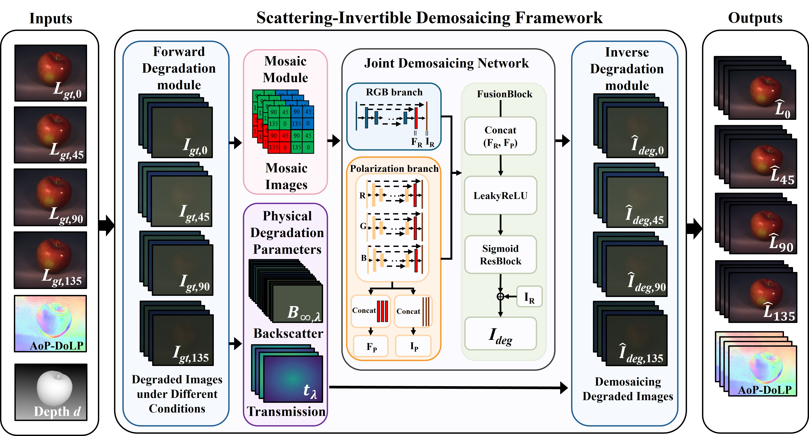

# SIDF: Scattering-Invertible Demosaicing Framework for DoFP Color Polarization Imaging in Scattering Media
By Yijia Xu, Xiaotong Fei, Linghao Shen, Kai Feng, Mohamed Reda and Haofeng Hu. 

---
>Division of Focal Plane (DoFP) and Color Polarization Filter Array (CPFA) cameras are widely used for imaging in scattering media, enabled by the ability of polarization imaging to suppress backscattered light in scattering environments. However, most existing studies focus on how polarization can be used for descattering, while overlooking the impact of scattering degradation on the demosaicing process. To address this issue, we propose a Scattering-Invertible Demosaicing Framework that integrates the physical scattering model into training through paired forward degradation and inverse restoration operations. The paired operations share the same physical degradation parameters, allowing the network to be jointly supervised by reconstruction fidelity in the scattering-domain and physical consistency in the air-domain. Experiments demonstrate that the proposed method effectively preserves structural details under scattering degradation and achieves superior quantitative performance, improving the CPSNR of S0 by 5.238 dB over the second-best method on the Tokyo Tech dataset under scattering degradation. The proposed method requires an average of only 0.282 s per image at a resolution of 1024×768 on an NVIDIA H20 GPU for inference, demonstrating its potential for real-time polarization imaging in scattering environments.
---

# Requirements
- Python==3.13
- torch==2.10.0
- torchvision
- numpy
- Pillow
- tqdm
- scipy
- h5py

## Code
model.py 
test.py
train.py
mosaic.py

## Inference
Download the weight from this [link](https://github.com/YishujiaXu0829/SIDF/releases/tag/v1.0)

## Training
Begin training:
python train.py

## SIDF Dataset
Download the dataset from this [link](https://github.com/YishujiaXu0829/SIDF/releases/tag/v1.0) and replace the "datasets" in the project with them. 

## Contact
If you have any questions, please feel free to contact me via "yijia_xu@tju.edu.cn" or open an issue.

## References
If you find this repository useful for your research, please cite the following work.
